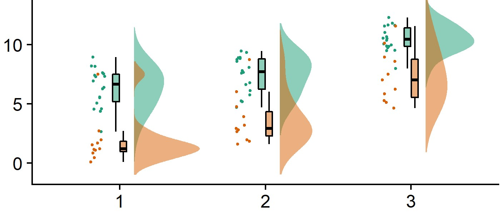

# Raincloud Plots

[](https://mybinder.org/v2/gh/RainCloudPlots/RainCloudPlots/master?filepath=tutorial_python%2Fraincloud_tutorial_python.ipynb)
[](https://mybinder.org/v2/gh/RainCloudPlots/RainCloudPlots/master?urlpath=rstudio)
[](https://zenodo.org/badge/latestdoi/144041501)


***Code and tutorials to visualise your data in a way that is both beautiful *and* statistically valid.***



### Table of contents

* [Read the preprint](#read-the-preprint)
* [Give us feedback](#give-us-feedback)
* [Citing raincloud plots](#citing-raincloudplots)
* [Interactive tutorials online](#interactive-tutorials-online)
* [Installing and running on your local machine](#installing-and-running-on-your-local-machine)
  * [Download from github](#download-from-github) (needed for all tutorials)
  * [Python environment](#python-environment)
  * [R environment](#r-environment)
  * [Matlab environment](#matlab-environment)

## Read the preprint

You can read all about Raincloud Plots in our [preprint at PeerJ](https://peerj.com/preprints/27137v1/).

> Allen M, Poggiali D, Whitaker K, Marshall TR, Kievit R. (2018) Raincloud plots: a multi-platform tool for robust data visualization. PeerJ Preprints 6:e27137v1 https://doi.org/10.7287/peerj.preprints.27137v1

## Give us feedback

We'd love to hear your thoughts and any feedback you have. The best place to leave comments on the preprint and the project in general is [at the PeerJ preprint](https://peerj.com/preprints/27137v1/). Just scroll to the bottom of that page and leave us feedback or ask a question.

You can also submit a pull request to this repository if you find a bug! Just check out our [contributing guidelines](CONTRIBUTING.md) for help getting started.

## Citing RainCloudPlots

We really hope you find these tutorials helpful and want to use the code in your next paper or presentation! This repository is made available under the [MIT license](LICENSE) which means you're welcome to use and remix the contents so long as you credit the creators: [Micah Allen](https://twitter.com/micahgallen?lang=en), [Davide Poggiali](https://twitter.com/dav1d3p0g?lang=en), [Kirstie Whitaker](https://twitter.com/kirstie_j?lang=en), [Tom Rhys Marshall](https://twitter.com/tomrhysmarshall?lang=en) and [Rogier Kievit](https://twitter.com/rogierk?lang=en).

There is a [zenodo archive](https://zenodo.org/badge/latestdoi/144041501) of the codebase and we ask that you cite the preprint along with the version of the code you used when referring to RainCloud plots.


> Allen M, Poggiali D, Whitaker K, Marshall TR, Kievit R. (2018) Raincloud plots: a multi-platform tool for robust data visualization. PeerJ Preprints 6:e27137v1 https://doi.org/10.7287/peerj.preprints.27137v1
>
> Allen M, Poggiali D, Whitaker K, Marshall TR, Kievit R. (2018) RainCloudPlots tutorials and codebase (Version v1.0). Zenodo. http://doi.org/10.5281/zenodo.1402959

Get in touch with [Kirstie Whitaker](https://github.com/KirstieJane) if you need help citing a particular version of this codebase.


## Interactive tutorials online

You don't have to take our word for it, you can use Project Jupyter's [binder](https://mybinder.org) to interact with the python and R tutorials yourself.

Just follow either of the links below.

* [](https://mybinder.org/v2/gh/RainCloudPlots/RainCloudPlots/master?filepath=tutorial_python%2Fraincloud_tutorial_python.ipynb) will open the python tutorial as an online jupyter notebook.
* [](https://mybinder.org/v2/gh/RainCloudPlots/RainCloudPlots/master?urlpath=rstudio) will open an online version of RStudio. You'll need to navigate to the [R tutorial](https://github.com/RainCloudPlots/RainCloudPlots/blob/master/tutorial_R/raincloud_tutorial_r.Rmd) (`/tutorial_R/raincloud_tutorial_r.Rmd`) from within RStudio and open the file to run it.

## Installing and running on your local machine

### Download from GitHub

The easiest way to get the code you need is to [download](https://github.com/RainCloudPlots/RainCloudPlots/archive/master.zip) a copy of this repository to your computer. (You can also [clone the repository](https://help.github.com/articles/cloning-a-repository/) if you're used to using git and GitHub.)

You'll notice that we've included three copies of the sampled data files, one for each language. This is to hopefully make it as easy for you as possible to run the tutorials and edit the code yourself.

Once you have the repository downloaded and unzipped, jump to the instructions for setting up the enviroment you're most comfortable with: [python](#python-environment), [R](#r-environment) or [matlab](#matlab-environment).

### Python environment

The code for RainCloud plots is packaged in the [ptitprince](https://github.com/pog87/PtitPrince) python package. It can be installed via pip using: `pip install ptitprince`.

There are a couple of other dependencies for the raincloud plots tutorial: they're listed in the [requirements.txt](requirements.txt) file in this repository. Note in particular that you must have [seaborn](https://seaborn.pydata.org/) version `0.9.0` or above to run the tutorial.

The following instructions will help you install all the necessary dependencies and get up and running really easily :sparkles:.

First, if you don't already have it, we recommend that you install [anaconda](https://conda.io/docs/user-guide/install/index.html) which will automatically install the [jupyter notebook](https://jupyter.readthedocs.io/en/latest/install.html#installing-jupyter-using-anaconda-and-conda) for you.

Then, from inside the `RainCloudPlots` folder type:

```
conda create --name rainpy python=3.6

activate rainpy

pip install -r requirements.txt

conda install nb_conda
```

This will create (and activate) a conda environment with all the the specific packages you need to run the tutorial.

A little note about jupyter notebooks and conda environments. If you have installed `nb_conda` as described above, you'll be able to choose the `rainpy` kernel in your jupyter notebook once it's open. Don't forget to switch from the default kernel when you open up the notebook.


From inside the `tutorial_python` direcotry, open up a jupyter notebook server by typing:

```
jupyter notebook
```

Double click on `raincloud_tutorial_python.ipynb` in your browser, make sure you're using the `rainpy` kernel, and execute the cells in the notebook.

### R environment

We recommend that you run the R tutorial through RStudio. You can download the appropriate version of **RStudio Desktop** for your operating system [here](https://www.rstudio.com/products/rstudio/download/).

If you already have RStudio please check that you have [knitr](https://cran.r-project.org/web/packages/knitr/index.html) version `1.20` or higher.

The following packages will be read in when you run `raincloud_tutorial_r.Rmd`. They'll be installed if you don't already have them.

```
packages <- c("cowplot", "readr", "ggplot2" ,
              "dplyr", "lavaan")
```

From inside the `tutorial_R` directory, run `raincloud_tutorial_r.Rmd`.

### Matlab environment

You'll need two dependencies to run the matlab tutorial: `cbrewer` which can be downloaded [here](https://uk.mathworks.com/matlabcentral/fileexchange/34087-cbrewer-colorbrewer-schemes-for-matlab) and `robust_statistical_toolbox` which should be downloaded [from GitHub](https://github.com/CPernet/Robust_Statistical_Toolbox) in the same way you [downloaded this repository](#download-from-github).

**NOTE**: the robust statistical toolbox is made available under the [GNU General Public License](https://github.com/CPernet/Robust_Statistical_Toolbox/blob/master/LICENSE) which is a ["copyleft"](https://en.wikipedia.org/wiki/Copyleft) license. GPL is compatible with [MIT](LICENSE) (the license for this repository) but supersedes it. Make sure that you are not violating this license when you run the matlab tutorial. :smiley:

Put both of these dependencies in the `tutorial_matlab` folder and then, from inside that directory, run `raincloud_tutorial_matlab.mlx`.
